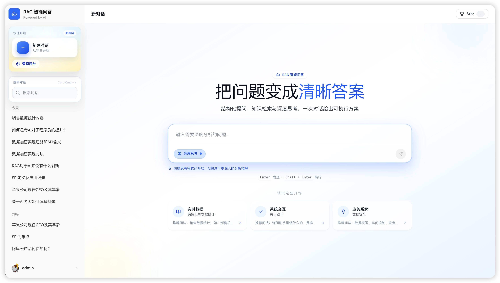
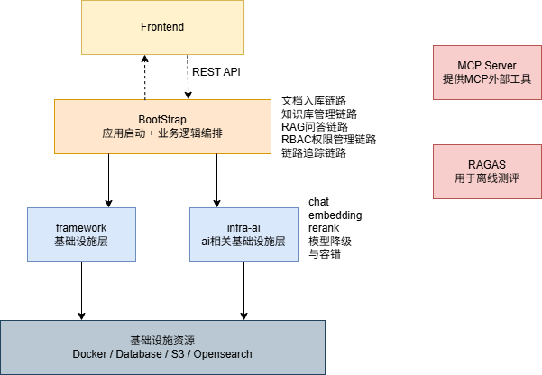
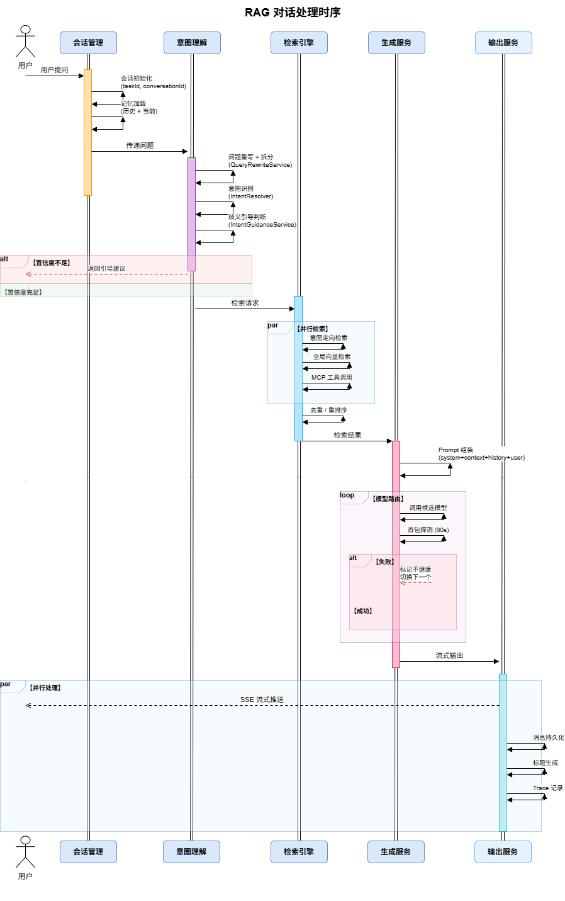
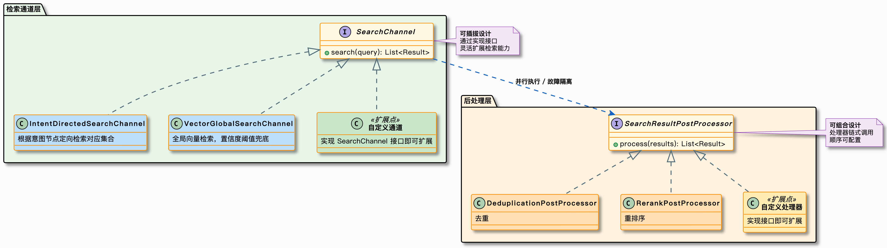
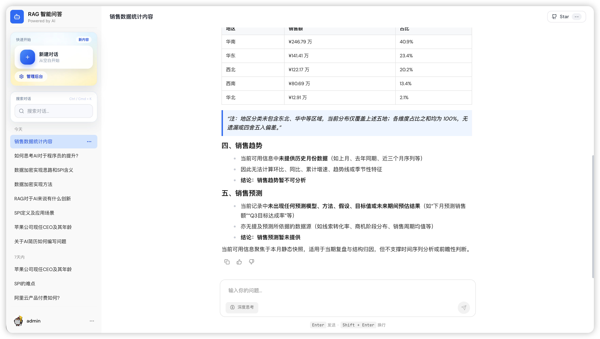
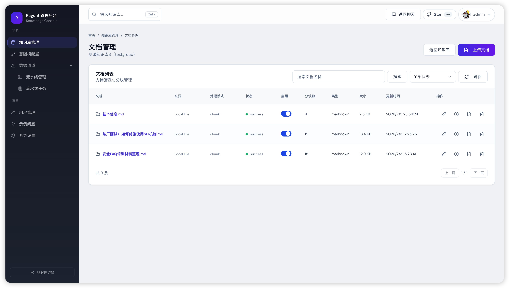
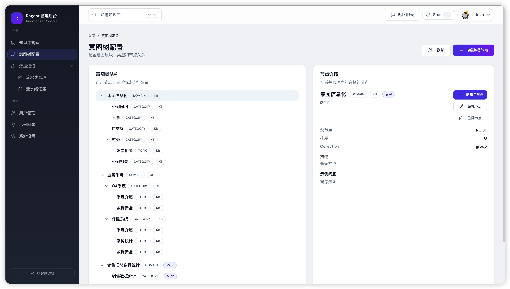

# HT KnowledgeBase


> 企业级 Agentic RAG 智能知识库平台，基于 Java 17 + Spring Boot 3 + React 18 构建，覆盖从文档入库到智能问答的全链路。



## 核心能力

- **多路检索引擎**：意图定向检索 + 全局向量检索并行执行，结果经去重、重排序后处理，兼顾精准度与召回率。
- **意图识别与引导**：树形多级意图分类（领域→类目→话题），置信度不足时主动引导澄清，而非硬猜答案。
- **问题重写与拆分**：多轮对话自动补全上下文，复杂问题拆为子问题分别检索。
- **会话记忆管理**：保留近 N 轮对话，超限自动摘要压缩，控 Token 成本不丢上下文。
- **模型路由与容错**：多模型优先级调度、首包探测、健康检查、三态熔断、自动降级。
- **MCP 工具集成**：意图非知识检索时自动提参调用业务工具，检索与工具调用无缝融合。
- **文档入库 ETL**：节点编排 Pipeline（抓取→解析→增强→分块→向量化→写入），灵活配置可扩展。
- **RBAC 权限控制**：基于角色的知识库访问控制，不同角色看到和检索的知识库不同。
- **知识库空间隔离**：用户登录后进入 Spaces 入口页，按权限展示可访问的知识库卡片；点击进入后会话锁定在该知识库范围内，对话历史、检索、校验全链路按空间隔离。
- **全链路追踪**：重写、意图、检索、生成每个环节均有 Trace 记录，排查与调优有据可依。
- **管理后台**：React 管理界面，覆盖知识库管理、意图树编辑、入库监控、链路追踪、角色管理、系统设置。

## 技术架构

### 系统总览



### 模块分层

HT KnowledgeBase 采用前后端分离架构，后端按职责分为四个 Maven 模块：


- **bootstrap** — 主 Spring Boot 应用，按业务域组织：`rag/`（RAG 核心）、`ingestion/`（文档入库）、`knowledge/`（知识库管理）、`core/`（解析/分块）、`user/`（认证/RBAC）、`admin/`（仪表盘）。
- **framework** — 跨域基础设施：异常体系、幂等控制、分布式 ID、用户/Trace 上下文透传、SSE 封装、统一响应体。
- **infra-ai** — AI 基础设施：LLM 客户端抽象、模型路由、Embedding 服务、Rerank 服务。
- **mcp-server** — MCP（Model Context Protocol）服务端实现。

### 技术栈

| 层面 | 技术选型 |
|------|---------|
| 后端框架 | Java 17、Spring Boot 3.5.7、MyBatis Plus 3.5.14 |
| 前端框架 | React 18、Vite、TypeScript、TailwindCSS |
| 关系数据库 | PostgreSQL |
| 向量数据库 | OpenSearch 2.18（混合搜索）/ Milvus 2.6 / pgvector（三选一，配置切换） |
| 缓存 | Redis + Redisson |
| 对象存储 | S3 兼容存储（RustFS） |
| 消息队列 | RocketMQ 5.x |
| 文档解析 | Apache Tika 3.2 |
| 模型供应商 | 百炼（阿里云）、SiliconFlow、Ollama（本地） |
| 认证鉴权 | Sa-Token 1.43 |
| 代码规范 | Spotless（自动格式化，CI 强制检查） |

## 核心设计

### RAG 问答链路

一次用户提问的完整链路：


RAG 对话处理时序：



```
限流入队 → RBAC 权限校验 → 加载会话记忆
→ 查询改写 + 子问题拆分 → 意图识别（并行）
→ 歧义引导（短路）/ System-Only 短路
→ 多通道检索（KB 向量检索 + MCP 工具调用，并行）
→ 去重 → 重排序 → 上下文组装 → LLM 流式生成（SSE）
→ 回答持久化 + 评估采集 + 链路追踪结束
```

### 多路检索架构



检索引擎采用多通道并行 + 后处理流水线架构。每个通道独立执行、互不影响，通过线程池并行调度。后处理器按顺序串联，逐步精炼检索结果。

OpenSearch 模式下支持混合搜索（KNN 向量 + 全文检索），权重可配。

### 模型路由与容错


多模型优先级调度，三态熔断器（CLOSED → OPEN → HALF_OPEN）独立维护每个模型的健康状态。首包探测阶段缓冲所有事件，确保模型切换时用户端不会收到半截的脏数据。

### 文档入库流水线


基于节点编排的 Pipeline，支持两种入库模式：
- **CHUNK 模式**：Extract → Chunk → Embed → Persist，轻量直接。
- **PIPELINE 模式**：Fetcher → Parser → Enhancer → Chunker → Enricher → Indexer，支持 LLM 增强和条件执行。

文档上传后通过 RocketMQ 事务消息异步处理，每个任务和节点都有独立的执行日志。

### 关键设计模式

| 设计模式 | 应用场景 | 解决的问题 |
|---------|---------|-----------|
| 策略模式 | SearchChannel、PostProcessor、MCPToolExecutor、VectorStoreService | 检索通道、后处理器、MCP 工具、向量库可插拔替换 |
| 工厂模式 | IntentTreeFactory、StreamCallbackFactory、ChunkingStrategyFactory | 复杂对象的创建逻辑集中管理 |
| 注册表模式 | MCPToolRegistry、IntentNodeRegistry | 组件自动发现与注册 |
| 模板方法 | IngestionNode 基类 | 入库节点统一执行流程 |
| 装饰器模式 | ProbeBufferingCallback | 首包探测能力 |
| 责任链模式 | 后处理器链、模型降级链 | 多个处理步骤按顺序串联 |
| AOP | @RagTraceNode、@ChatRateLimit | 链路追踪和限流与业务代码解耦 |

## 可扩展性

核心模块均预留扩展点，新增实现类注册为 Spring Bean 即自动生效：

- **检索通道**：实现 `SearchChannel` 接口
- **后处理器**：实现 `SearchResultPostProcessor` 接口
- **MCP 工具**：实现 `MCPToolExecutor` 接口
- **入库节点**：实现 `IngestionNode` 接口
- **向量数据库**：实现 `VectorStoreService` + `VectorStoreAdmin` 接口
- **模型供应商**：在 infra-ai 层实现 `ChatClient` 接口

## 控制台

### 知识库空间入口

登录后进入 Spaces 页面，按 RBAC 权限展示可访问的知识库卡片，显示统计数据（知识库数量、文档总数）。点击卡片进入对应知识库的聊天空间。


### 用户问答

进入知识库空间后，会话锁定在该知识库范围内问答。支持自然语言输入、深度思考模式、示例问题快速填充、Markdown 渲染、代码高亮、回答评价。侧边栏仅显示当前空间的对话历史。



### 管理后台

覆盖仪表盘、知识库管理、意图树配置、入库监控、链路追踪、用户管理、角色管理、系统设置。






## 快速启动

### 1. 基础设施

#### PostgreSQL + Redis

PostgreSQL 和 Redis 需自行安装或通过 Docker 启动：

```bash
# PostgreSQL（项目使用 pgvector 镜像，支持向量扩展）
docker run -d --name postgres -p 5432:5432 \
  -e POSTGRES_PASSWORD=postgres \
  pgvector/pgvector:pg16

# Redis
docker run -d --name redis -p 6379:6379 redis:7
```

#### 初始化数据库

```bash
# 创建数据库
docker exec postgres psql -U postgres -c "CREATE DATABASE ragent;"

# 导入完整表结构（25 张表，含索引和约束）
docker exec -i postgres psql -U postgres -d ragent < resources/database/full_schema_pg.sql

# 导入初始数据（默认 admin 账户）
docker exec -i postgres psql -U postgres -d ragent < resources/database/init_data_full_pg.sql
```

#### 向量数据库（三选一）

根据需要选择一种向量数据库，在 `application.yaml` 中配置 `rag.vector.type`：

| 方案 | 配置值 | Docker Compose 文件 | 端口 | 说明 |
|------|--------|-------------------|------|------|
| **OpenSearch** | `opensearch` | `resources/docker/opensearch-stack.compose.yaml` | 9201 | 支持混合搜索（KNN + 全文），推荐 |
| **Milvus** | `milvus` | `resources/docker/milvus-stack-2.6.6.compose.yaml` | 19530 | 专业向量库，含 RustFS + etcd + Attu UI |
| **pgvector** | `pgvector` | 无需额外部署（复用 PostgreSQL） | 5432 | 最轻量，适合开发测试 |

```bash
# 示例：启动 OpenSearch
docker compose -f resources/docker/opensearch-stack.compose.yaml up -d

# 示例：启动 Milvus（含 RustFS 对象存储 + Attu 管理界面）
docker compose -f resources/docker/milvus-stack-2.6.6.compose.yaml up -d

# 资源受限环境可使用 lightweight 版本（限制内存上限）
docker compose -f resources/docker/lightweight/milvus-stack-2.6.6.compose.yaml up -d
```

#### RocketMQ

```bash
# 启动 RocketMQ（NameServer + Broker + Dashboard）
docker compose -f resources/docker/rocketmq-stack-5.2.0.compose.yaml up -d

# ARM 架构（如 Apple Silicon）使用 AMD 兼容版
docker compose -f resources/docker/rocketmq-stack-amd-5.2.0.compose.yaml up -d
```

### 2. 启动应用

```bash
# 构建（跳过测试）
mvn clean install -DskipTests

# 启动后端（端口 9090，上下文路径 /api/ragent）
mvn -pl bootstrap spring-boot:run

# 启动前端（默认端口 5173）
cd frontend && npm install && npm run dev
```

### 基础设施端口一览

| 服务 | 端口 | 管理界面 |
|------|------|---------|
| 应用后端 | 9090 | - |
| 前端 | 5173 | - |
| PostgreSQL | 5432 | - |
| Redis | 6379 | - |
| RocketMQ NameServer | 9876 | Dashboard: 8082 |
| OpenSearch | 9201 | Dashboards: 5602 |
| Milvus | 19530 | Attu: 8000 |
| RustFS (S3) | 9000 | Console: 9001 |

### 数据库脚本说明

| 文件 | 用途 |
|------|------|
| `resources/database/full_schema_pg.sql` | 完整建表 DDL（25 张表 + 索引 + 约束），新环境一次执行 |
| `resources/database/init_data_full_pg.sql` | 初始数据（默认 admin 账户） |
| `resources/database/schema_pg.sql` | 原始建表脚本（含最新字段，可用于全新初始化） |
| `resources/database/upgrade_v1.0_to_v1.1.sql` | v1.0 → v1.1 增量升级 |
| `resources/database/upgrade_v1.1_to_v1.2.sql` | v1.1 → v1.2 增量升级（RBAC 表） |
| `resources/database/upgrade_v1.2_to_v1.3.sql` | v1.2 → v1.3 增量升级（会话关联知识库，kb_id） |
| `resources/database/fixture_pr3_demo.sql` | PR3 curl 矩阵演示数据（alice/bob/carol + 研发/法务 KB），仅 Mode B 使用 |

## PR3 Demo

演示跨部门 RBAC 隔离 + security_level 检索过滤的完整流程。PR3 使用**两种独立运行模式**：

### Mode A — UI CRUD walkthrough（证明前端创建闭环）

1. 重建数据库：仅 `schema_pg.sql` + `init_data_pg.sql`（**不加载 fixture**）
2. 清空 OpenSearch + Redis
3. 启动后端 + 前端
4. 按 `docs/dev/pr3-demo-walkthrough.md` 的 12 步逐项执行（admin 用 UI 创建部门 / 用户 / 角色 / 分配 / 上传文档）

### Mode B — curl bypass matrix（证明后端授权边界）

1. 重建数据库：`schema_pg.sql` + `init_data_pg.sql` + `fixture_pr3_demo.sql`
2. 按 `docs/dev/pr3-curl-matrix.http` 逐条跑，验证每条权限规则在前端 UI 之外也被后端拦截

两种模式**不可混合**：Mode A 依赖 UI 创建来证明 CRUD 闭环，若 fixture 预塞数据，walkthrough 的步骤 2-5 就没有证明价值。Mode B 依赖固定业务键来让 curl 断言稳定，若没有 fixture，账号/ID 每次运行都不同。

设计文档: `docs/superpowers/specs/2026-04-12-pr3-rbac-frontend-demo-design.md`
