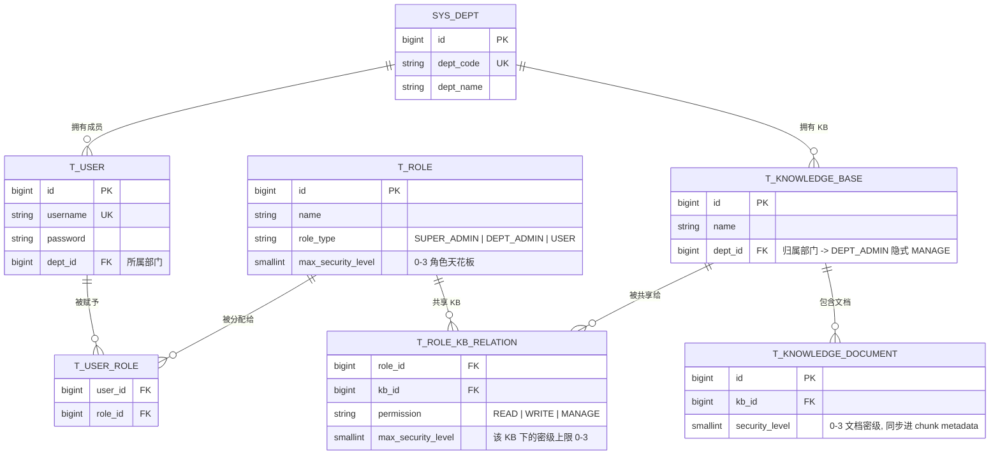
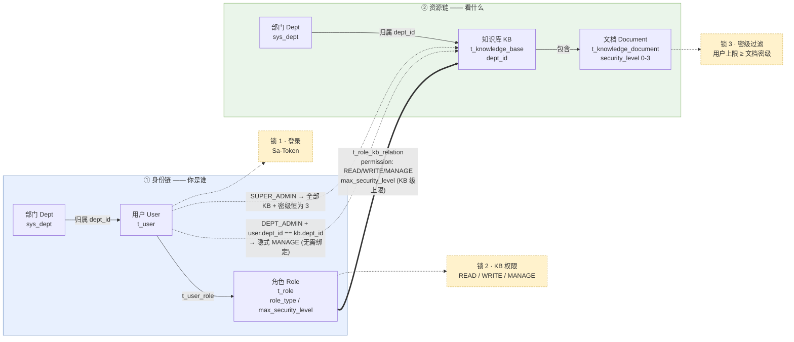

# 图 1 · 权限模型（ER 图 + 授权链）

本图配合《详细设计文档 - 权限管理设计》章节第 2、3 节使用。
- **上半部（ER）**：权限相关数据表结构与关联关系。
- **下半部（授权链）**：身份链（你是谁）与资源链（看什么）的业务视图，以及两者如何通过角色-KB 绑定汇合。

---

## (a) 数据模型 ER 图

---

## (b) 授权链：身份链 × 资源链

---

## 关键要点（配合图阅读）

1. **ER 图的核心是两张关联表**：
   - `t_user_role` 承载 "用户—角色" N:N
   - `t_role_kb_relation` 承载 "角色—KB" N:N，并附带 `permission` 和 KB 级 `max_security_level`
2. **`dept_id` 出现在两处**（`t_user.dept_id` 与 `t_knowledge_base.dept_id`），两者相等即触发 DEPT_ADMIN 的**隐式 MANAGE**（授权链图中的虚线）。
3. **授权最终落点是文档**：用户能否读到一篇文档，必须同时通过"身份链 → 锁 2 → 资源链 → 锁 3"四段路径。
4. **密级有两层天花板**：角色本身的 `max_security_level`（粗）+ 绑定到具体 KB 时的 `max_security_level`（细）。实际生效取 MAX 跨角色聚合。
