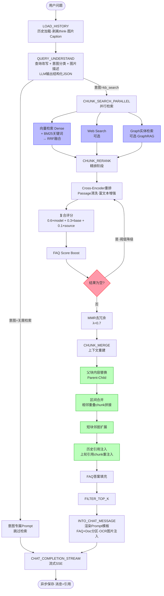
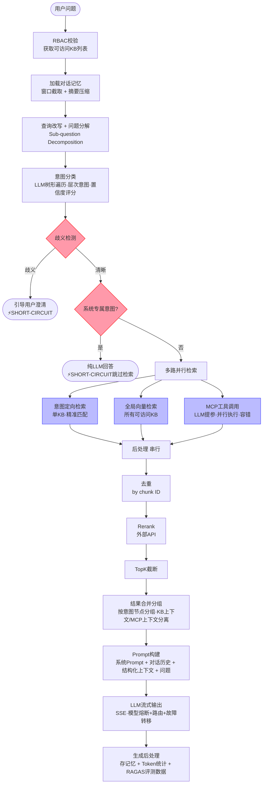

# RAG 链路对比：WeKnora vs rag-knowledge-dev

---

## 完整链路流程对比

| 阶段 | WeKnora (Go) | rag-knowledge-dev (Java) | 差异说明 |
|:----:|:------------|:------------------------|:--------|
| **前置校验** | — | ✅ RBAC：过滤可访问 KB 列表 | 你的更完善 |
| **历史加载** | ✅ LOAD_HISTORY<br/>配对Q&A轮次，剥离`<think>`标签<br/>图片Caption注入历史 | ✅ 对话记忆<br/>窗口截取 + 摘要压缩 | 你的有摘要压缩，更节省上下文 |
| **查询理解** | ✅ QUERY_UNDERSTAND<br/>改写 + 意图分类 + 图片描述<br/>输出结构化JSON | ✅ 查询改写 + 问题分解<br/>意图树形分类（层次+置信度） | 你的意图分类更精细（树形层次）<br/>WeKnora多图片理解能力 |
| **意图路由** | ⚠️ 简单意图判断<br/>（需不需要检索） | ✅ 歧义引导（SHORT-CIRCUIT）<br/>系统专属意图（SHORT-CIRCUIT）<br/>意图定向检索 | 你的短路机制更完善 |
| **检索阶段** | ✅ **并行三路**<br/>① 向量+BM25 RRF融合<br/>② Web Search<br/>③ Graph/实体搜索 | ✅ **并行两路**<br/>① 意图定向检索<br/>② 全局向量检索<br/>③ MCP工具调用（并行）| 各有侧重：<br/>WeKnora多Web/Graph<br/>你的有MCP工具 |
| **后处理** | ✅ **精细后处理**<br/>① Cross-Encoder精排<br/>② 复合评分(0.6+0.3+0.1)<br/>③ FAQ加权<br/>④ **阈值自动降级**<br/>⑤ **MMR去冗余** | ⚠️ **基础后处理**<br/>① 去重<br/>② Rerank API<br/>③ TopK截断<br/>— 无MMR<br/>— 无降级机制 | ⭐ WeKnora明显领先 |
| **上下文重建** | ✅ **CHUNK_MERGE**<br/>① 父块内容替换<br/>② 区间合并<br/>③ 短块邻居扩展<br/>④ 历史引用注入<br/>⑤ FAQ答案填充 | ❌ 无此阶段<br/>直接使用原始chunk | ⭐ WeKnora明显领先 |
| **TopK截断** | ✅ FILTER_TOP_K | ✅ TopK过滤 | 相同 |
| **表格分析** | ✅ DATA_ANALYSIS<br/>CSV/Excel特殊处理 | — | WeKnora专项支持 |
| **Prompt构建** | ✅ INTO_CHAT_MESSAGE<br/>模板渲染<br/>FAQ/Doc分区显示<br/>图片OCR/Caption注入 | ✅ RAGPromptService<br/>按意图节点分组格式化<br/>来源归属标注 | 各有特色：<br/>WeKnora多模态<br/>你的按意图分组更结构化 |
| **LLM生成** | ✅ 流式SSE<br/>Fallback兜底响应 | ✅ 流式SSE<br/>模型熔断+路由+故障转移 | 你的模型路由更健壮 |
| **生成后** | ✅ 异步存储消息+引用 | ✅ 存记忆+Token统计<br/>+RAGAS评测数据采集 | 你的评测能力更完善 |

---

## 流程示意图

### WeKnora RAG 链路



---

### rag-knowledge-dev RAG 链路



---

## 关键差距可视化

```
检索质量链路对比（后处理阶段）

WeKnora:
Rerank候选 → [Cross-Encoder精排] → [复合评分] → [FAQ加权] → [阈值降级兜底] → [MMR去冗余] → TopK
                                                                      ↑
                                                               无结果自动重试

rag-knowledge-dev:
Rerank候选 → [Rerank API] → TopK
                ↑
           改进空间：加入MMR + 阈值降级


上下文质量链路对比（Merge阶段）

WeKnora:
RerankResult → [父块替换] → [区间合并] → [邻居扩展] → [历史引用注入] → [FAQ填充] → LLM
                  ↑              ↑              ↑
              上下文完整      连续性保证      多轮连贯性

rag-knowledge-dev:
RerankResult → [分组格式化] → LLM
                  ↑
           改进空间：加入区间合并 + 邻居扩展 + 历史引用注入
```

---

## 能力维度评估

| 能力维度 | WeKnora | rag-knowledge-dev | 说明 |
|:-------:|:-------:|:-----------------:|:----|
| 意图理解 | ⭐⭐⭐⭐ | ⭐⭐⭐⭐⭐ | 你的树形层次意图更精细 |
| 上下文重建 | ⭐⭐⭐⭐⭐ | ⭐⭐ | 父块/区间合并/邻居扩展均缺失 |
| Rerank质量 | ⭐⭐⭐⭐⭐ | ⭐⭐⭐ | 缺MMR + 降级 + 复合评分 |
| 多路检索 | ⭐⭐⭐⭐ | ⭐⭐⭐⭐ | 各有侧重，基本持平 |
| 模型健壮性 | ⭐⭐⭐ | ⭐⭐⭐⭐⭐ | 你的熔断+路由更完善 |
| 多模态支持 | ⭐⭐⭐⭐ | ⭐ | 你的系统暂无图片处理 |
| 评测能力 | ⭐⭐ | ⭐⭐⭐⭐⭐ | 你的RAGAS集成更完善 |

---

## 建议迁移优先级

| 优先级 | 特性 | 预计工期 | 收益 |
|:------:|:----|:--------:|:-----|
| 🔴 P0 | Rerank 阈值自动降级 | 0.5天 | 消除空结果问题 |
| 🔴 P0 | MMR 去冗余 | 1天 | 减少上下文冗余，提升回答质量 |
| 🟠 P1 | 历史引用注入 | 1天 | 多轮对话上下文连贯性 |
| 🟠 P1 | 区间合并 + 邻居扩展 | 2天 | 上下文完整性显著提升 |
| 🟡 P2 | 父子块 Chunking | 3-5天 | 需重新入库，收益最大 |
| 🟡 P2 | 复合评分 | 1天 | 引入Web Search后适用 |
| 🟢 P3 | 多模态图片理解 | 5天+ | 有图文知识库需求时引入 |
